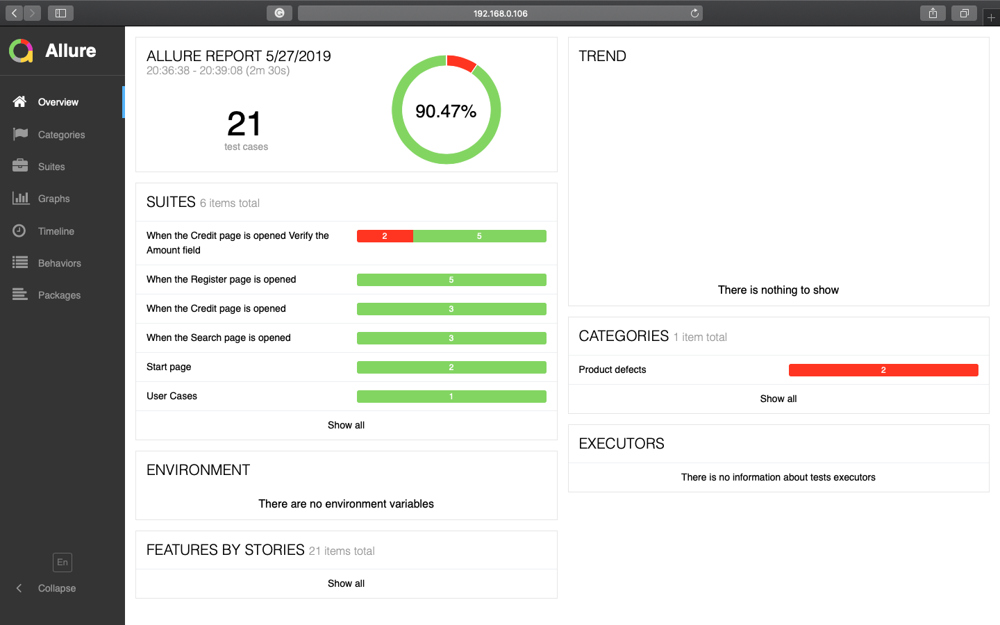
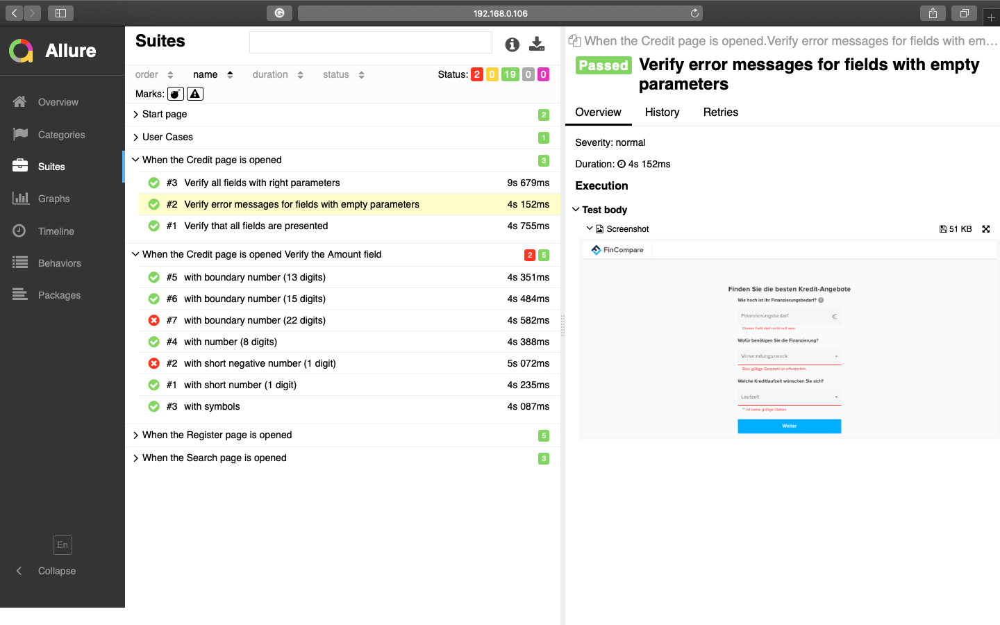
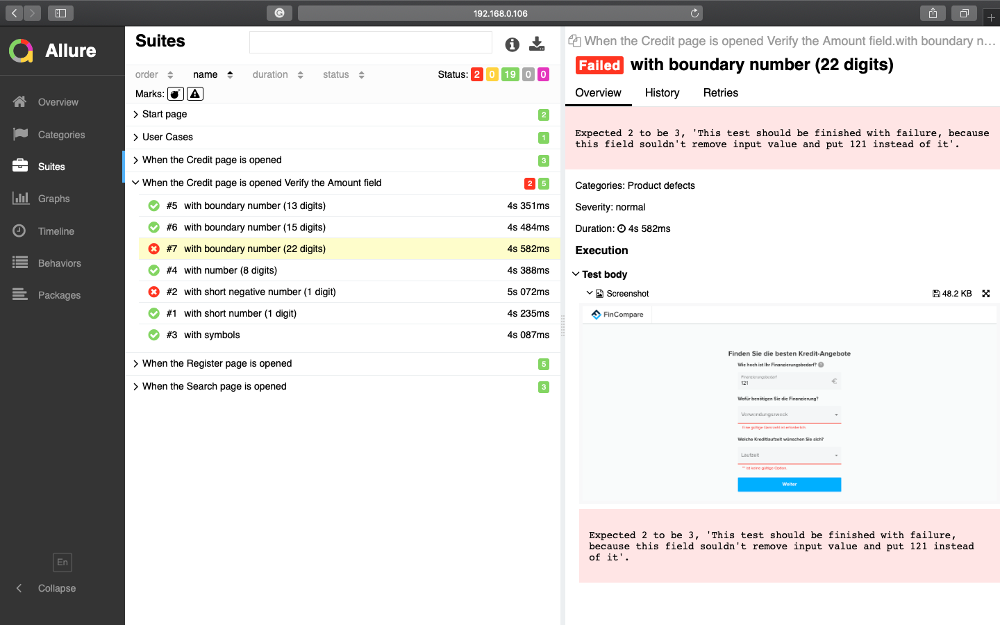
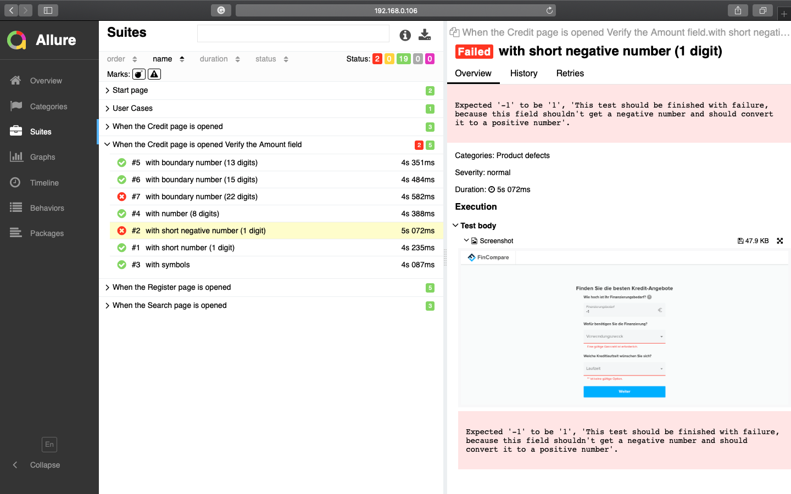

# How to install

#### Clone the repo and run
```bash
bash post_clone.sh
```

#### to install [HomeBrew](https://brew.sh), [NodeJS](https://nodejs.org), [Allure](http://allure.qatools.ru)
#### and local dependencies [Protractor](https://www.protractortest.org), [Jasmine Allure Reporter](https://docs.qameta.io/allure/), [ESM](https://www.npmjs.com/package/esm)

# How to run

#### Go to the project folder and run
```bash
npm start
```

#### to launch a standalone selenium server

#### Then run
```bash
npm test
```

#### to run tests

# How to see a test report

#### When testing will be completed run
```bash
bash report.sh
```
#### or run it right after clone the repo to see an attached report example

#### Overview


#### Detailed report


